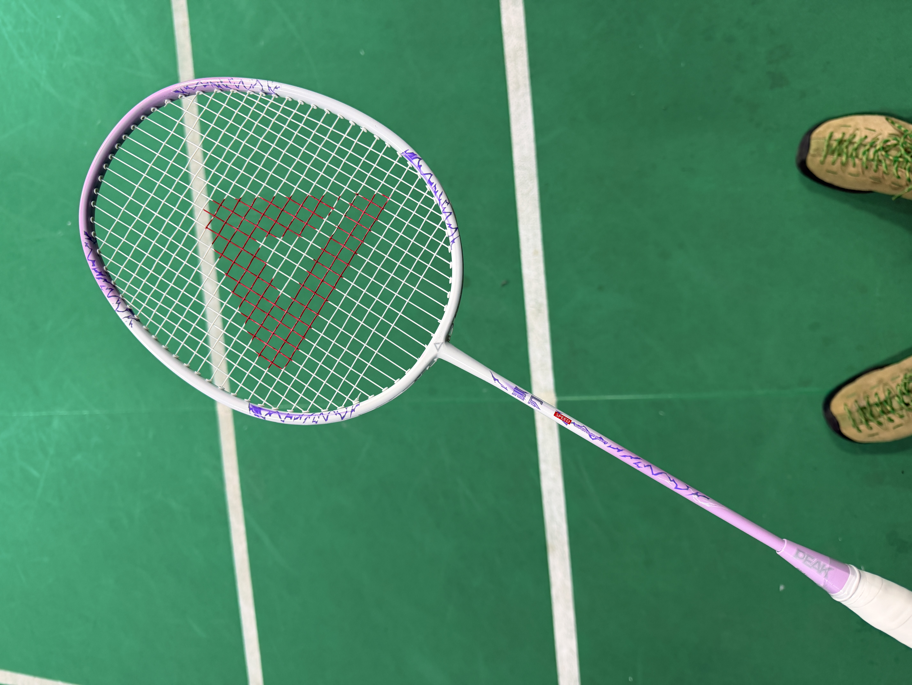
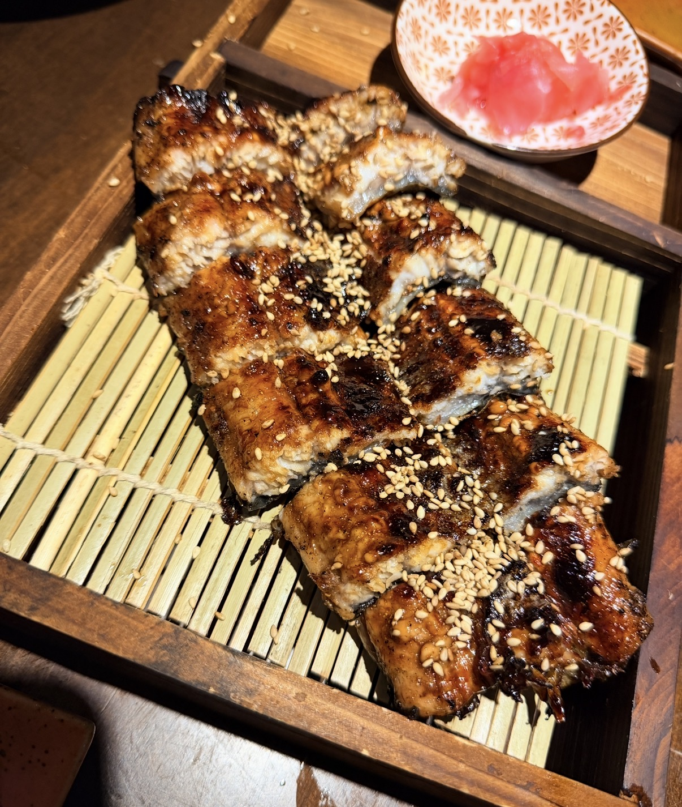
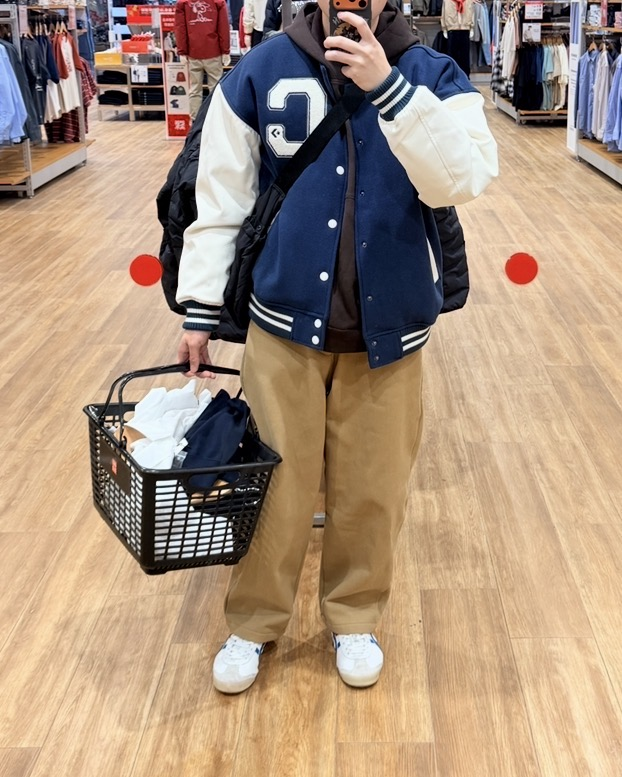
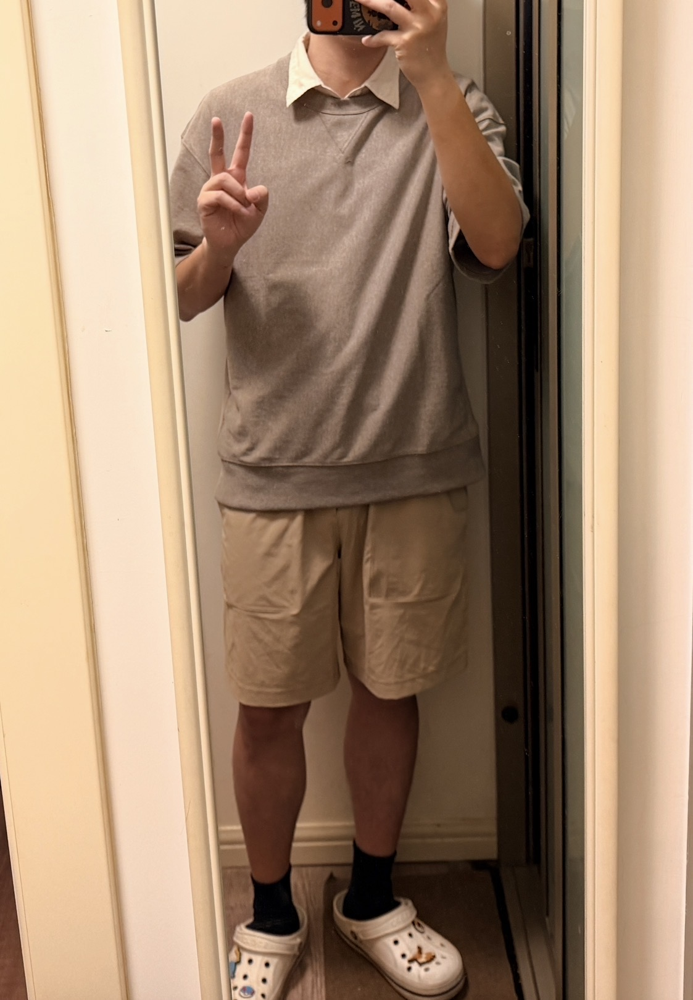

## 写在前面

这几天看到好多朋友有发 日记/周记 这类的东西 想来还是要为blog选择一个大的主题 想来想去记录生活的日常 没有宏大的叙事 没有明确的方向 醒来、工作、发呆 偶尔和朋友说几句无关紧要的话 看似无足轻重的片段 慢慢堆积成我  那主题就定为**「浮生日记」**好了

## 和朋友打了羽毛球

打得不算特别认真（其实我并不是一个擅长和喜欢运动的人 更多是凑热闹来回跑一跑 朋友还把闲置的防毒口罩带给了我说是我新医院装修用得上 一个有点荒诞又很现实的东西——塑料的质感、略微工业化的外形 和那种轻松的运动氛围混在一起 显得格格不入 却贴合生活 又显得很合理 

最近确实忙的焦头烂额 医院这边在装修 手上的诊还是源源不断的来 最近光是流浪猫绝育/终止妊娠 就有接近10只了 本来计划3月底可以搬完 现在看来可能要4月初才能结束了 前两天搬铁笼子的时候还不小心扭到了腰… 之后稍微注意点吧 

试戴了一下吸气会比较费力 会稍微有点压脸 似乎是防护级别比较高的type 防甲醛应该是绰绰有余 感谢好友汤包 阿里嘎多 

## 晚酌

很喜欢的一家小酒馆 鸡肉串相当好吃！老板是台湾人所以说起话来有一种微妙的磁力 纯预约制保障人不会太多 有些菜品也要提前预约才能吃到） 店里有两个500L的冰柜放的都是进口啤酒/气泡 种类超多 唯一的缺点是出餐有点慢 但是毕竟是夫妻店只有两个人 所有食物也都是现做的也可以理解吧 那天去的比较晚了 平时常用的杯子已经用完了p2 ）所以给用了p1的样式 老板说会大一点 给我多打了一点酒 不知道从什么时候开始变得很喜欢喝酒 可能是大学毕业之后 现在一个人没事做的时候去喝酒 甚至已经成了很靠前的选项 总之对自己的酒量很有自知之明了 以前不懂事的时候喝断片过两次 有一次还诱发了阑尾炎 属实是很痛苦不想再经历了 

⬆️再安利一下无敌好味道的蒲烧鳗鱼

## OOTD相关

最近下雨的天气比较多但是能明显的感觉到温度的回升 尤其我是骑摩托出行比较多就更对温度敏感

收起了一些厚重的棉袄和羽绒服 准备拿出一点夏天的衣服穿（ 南京没有春秋…）喜欢的两条短裤都已经洗褪色了 决定稍微购物一下 之前朋友吐槽因为现实中没有好好的搭配衣服 打开衣柜永远是优衣库GU基础款 导致oc也只能穿很基础的服饰（bushi 故没有拖沓直接到线下去买衣服了

特意避开了优衣库GU 然后购入了lululemon的基础款短裤和外套…

我真是…唉…可能在穿衣风格上很难进行改变了 其实也没有不满意 从高中时期开始就是喜欢纯色基础的衣服 不喜欢特别夸张的设计/图案 一直延续到现在也没有变 

一些OOTD

写到这里有点累了 这些事情单看都很小 小到不太值得专门讲出来 但如果不记下来 它们很快就会消失 好像从来没有发生过一样

所以还是写下来了 谢谢你看完这些有的没的

下次见