## 写在前面

短短的几天发生了不少事情 让我有素材记录下来写成新的一篇blog 仔细看了下目前更新的频率刚好是一周一更 是不是应该改成「浮生周记」更为恰当呢 好像也无所谓了

---

## 食物

很多朋友出去一起吃饭的时候会拍照 我的话基本是直接动筷子 但是最近翻相册好像拍了不少食物）朋友推荐的汉堡肉饭  牛肉饼五分熟上桌后会在面前有一个小铁板一直加热 性价比也比较高 两块肉饼的set45CNY

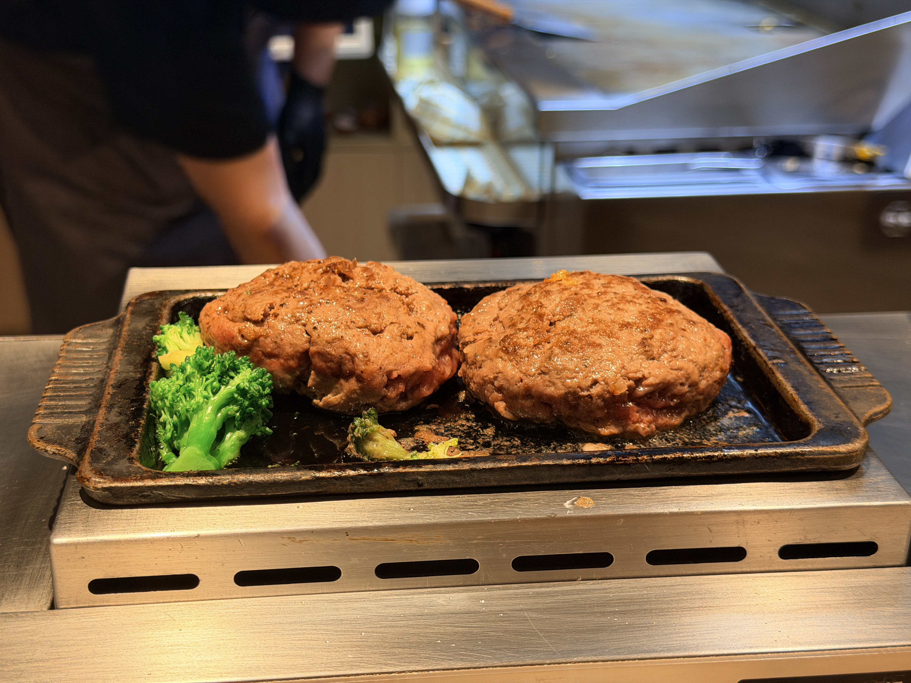

但是作为很喜欢吃肉的人 小ton直接选择了3块肉饼的set！然后全部吃光了 去年11月份到现在胖了3kg 也许和暴涨的食欲也有关系吧 

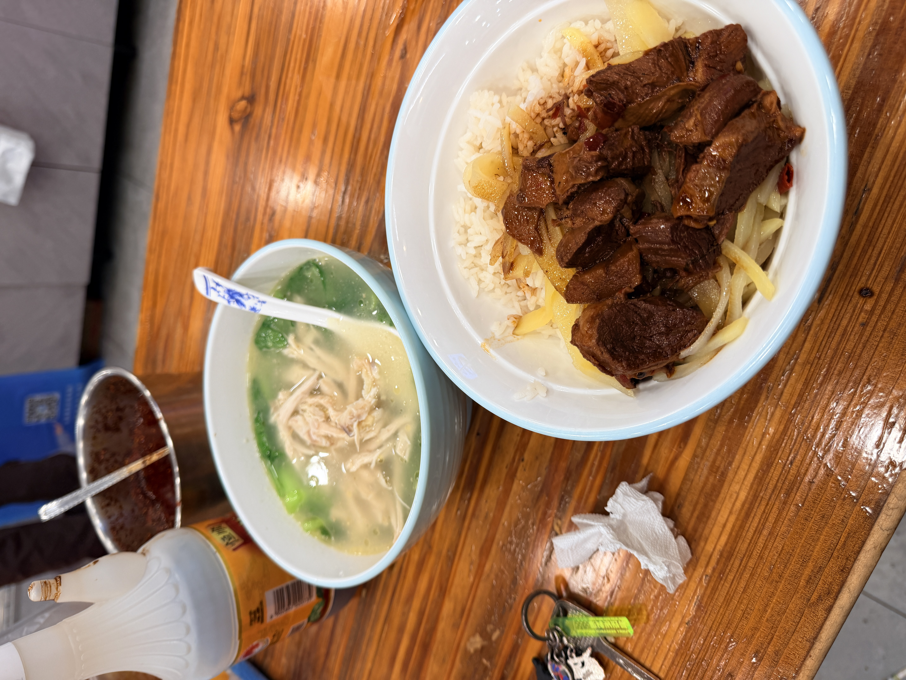

另一家常去的店 是24小时营业的一家鸡汤面 主打的品项是鸡腿面 我个人是更喜欢柴柴的那种肉 所以选了炖肉饭➕鸡丝 鸡丝会放在汤里 半夜快一点能吃到这样一份属实是太幸福了 

---

## 蛇蛇蛇

最近感觉闯到蛇窝里了 现在的医院是全科异宠 但是蛇的话大家还是比较恐惧 实际上目前爬行动物都是我一个人在看 得益过去特别喜欢养蜥蜴/蛇 所以对各种爬行动物的习性生理结构 比一般人稍微多懂一些 而且爬行动物的魅力真的很特别

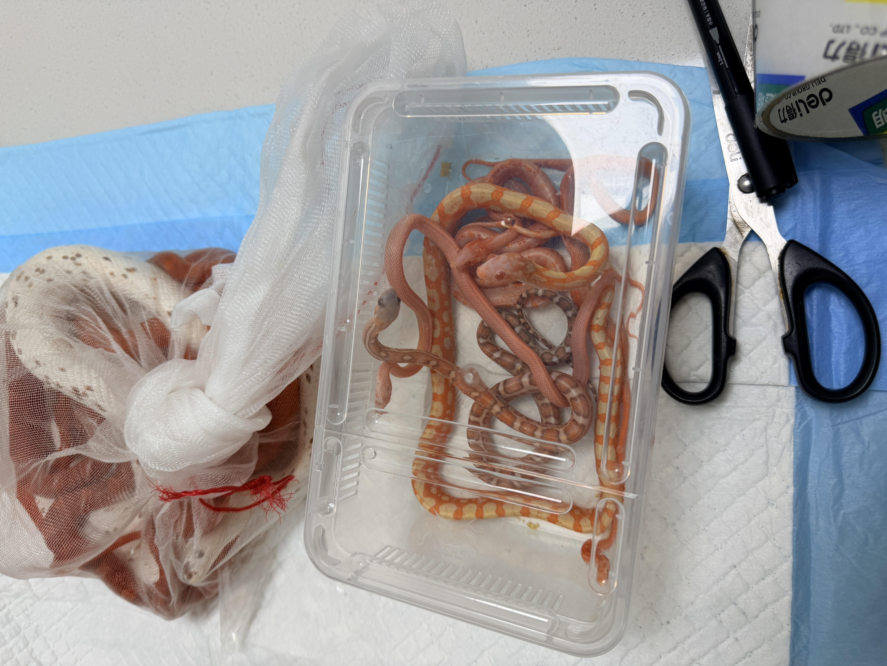

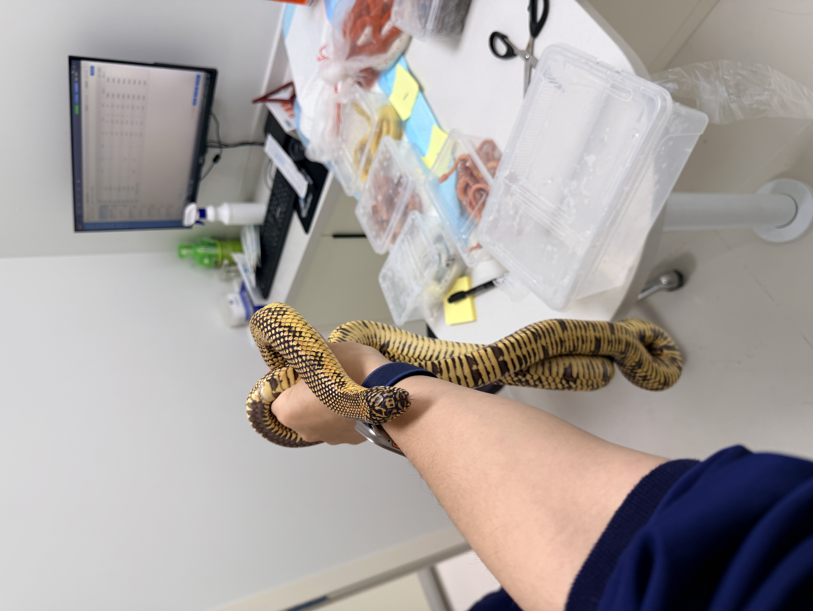

p2是一条超过2.5kg的斑节 养的这么好的个体也是非常少见了 它的主人是一个老前辈 自己繁殖和饲养了很多蛇 这次带了15条来测寄生虫 聊了很多！

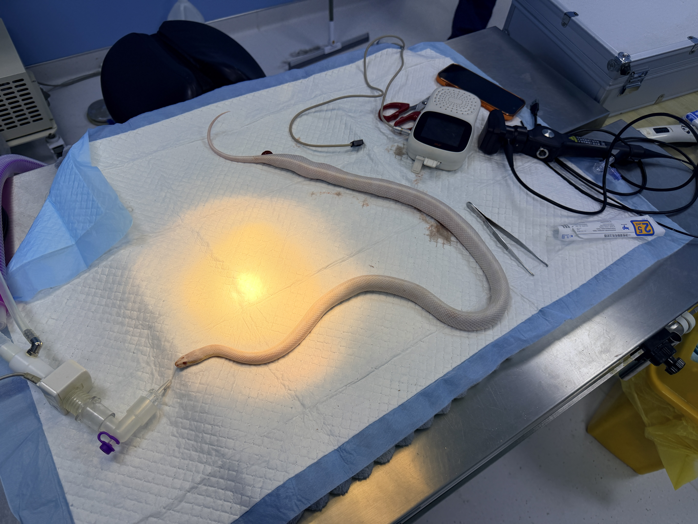

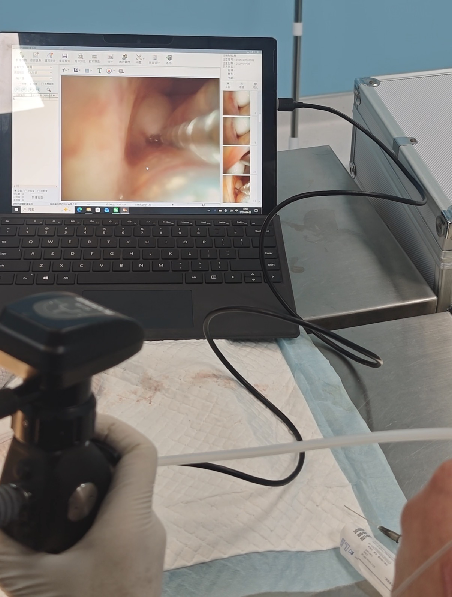

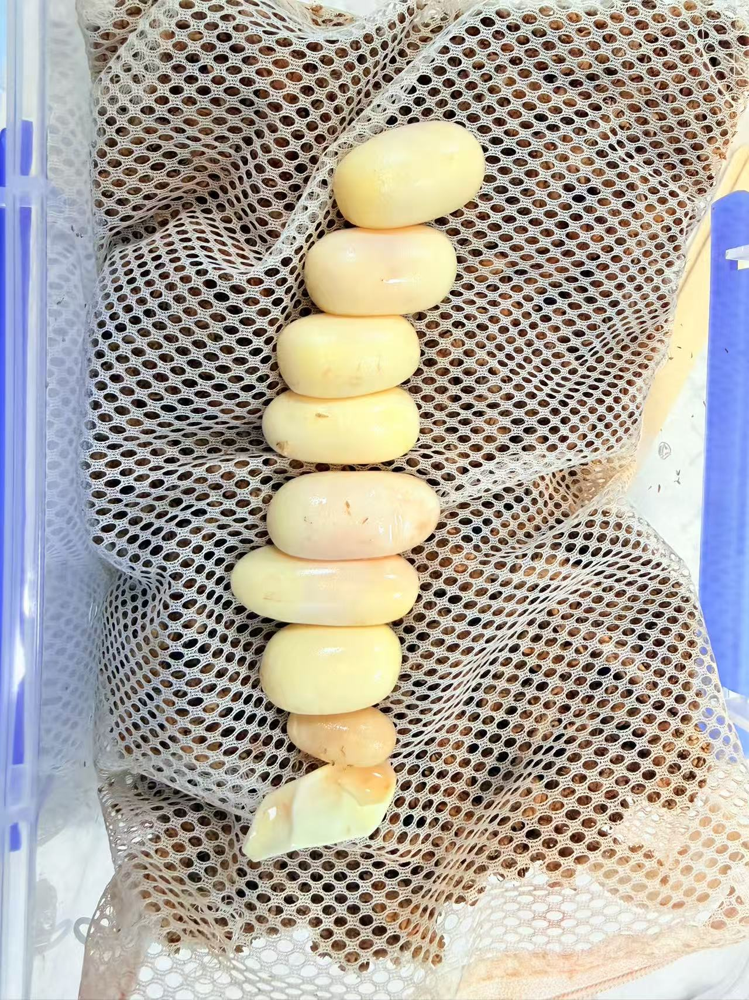

繁殖季每年都会遇到卡蛋的蛇 内窥镜取蛋 轻轻松松啊 不建议450g以下母蛇（玉米或同等体型蛇类）进行繁育 勿抱着反正都要生水蛋不如配一下的心态！受精蛋大小比起水蛋大很多极易难产卡蛋 （下方向上那颗小小的就是水蛋 其余为受精蛋）

---

## 新车

本来是想去试驾最新的电离版本NX500 然后到了本田店里说新的展车还没上保险 不可以试驾 遂失望离开 然后旁边看到一家张雪机车 我是对国产的机车不太了解 最近张雪的机车好像拿了个什么冠军 就进去想看下 人很多 销售还是很热情的接待了我 本来没打算买的 耐不住销售热情 试驾了一下复古风格的500F 比我想象的更加不错 而且比起它仿造的车型cb500sf便宜了差不多2w）遂短暂纠结了下就买了下来 

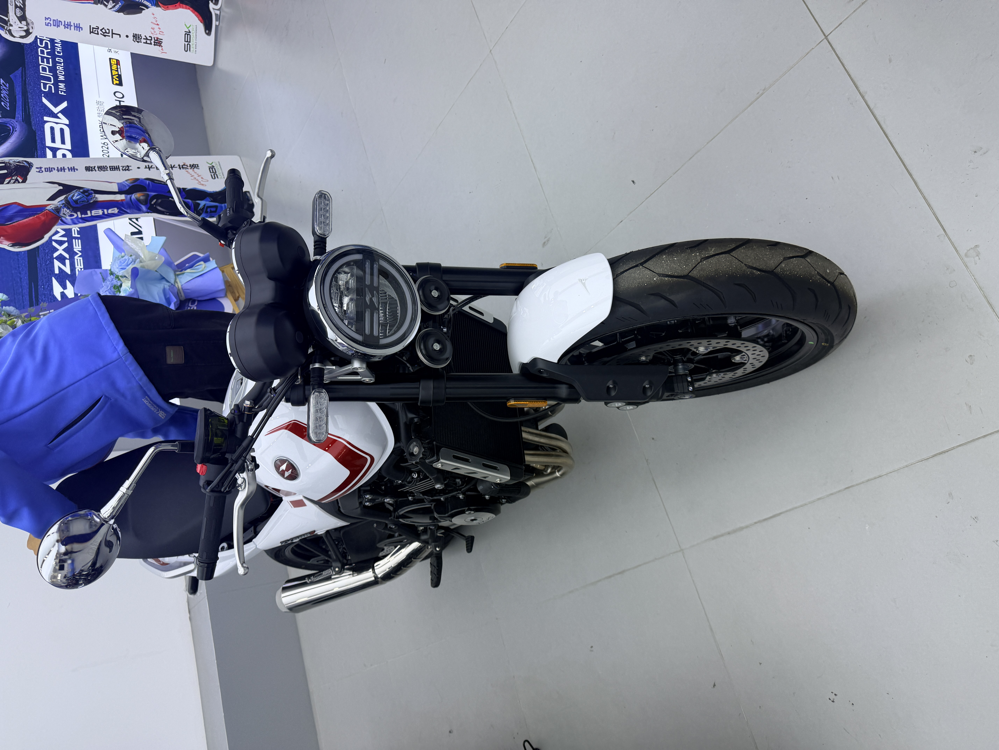

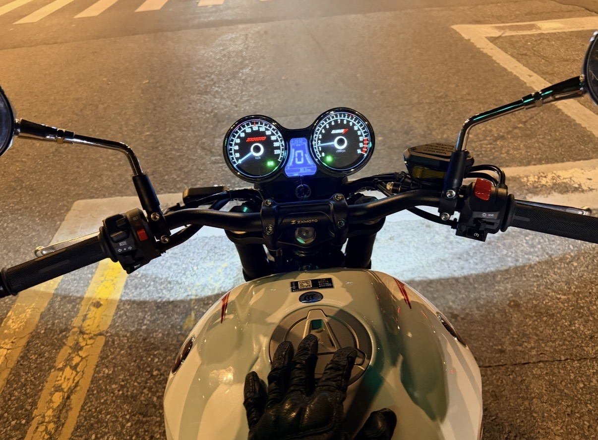

红白的配色和双筒仪表很对我味 第一次骑四缸的车 动力非常不错 发动机在6000转会发出好听的哨声 其实一直不明白为什么很多人要把排气管改的很吵 我觉得发动机运行的声音才是一个车最好听的部分）

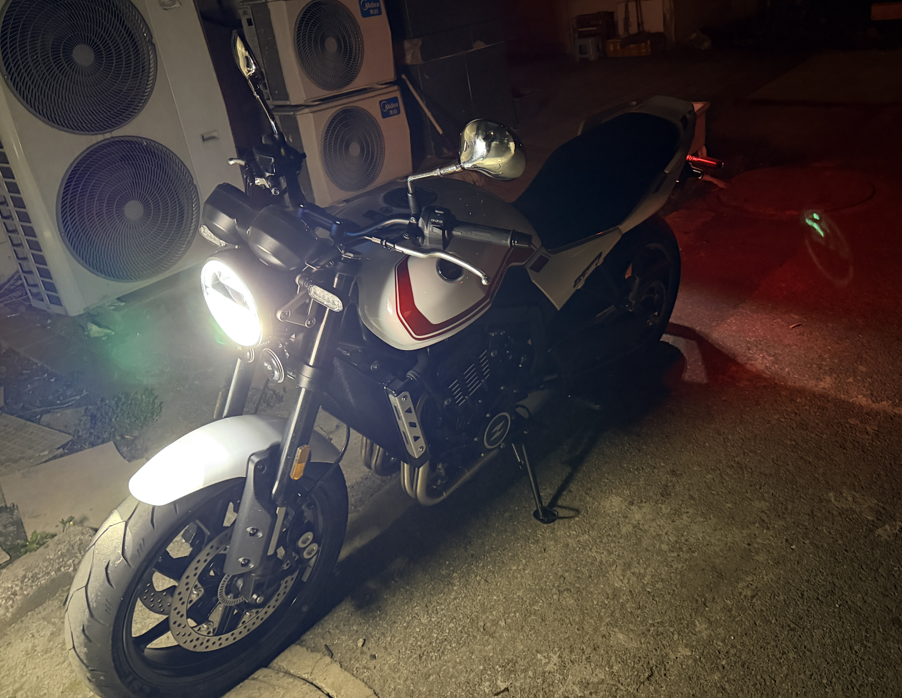

⬆️圆圆的大灯也很有味

拥有新车其实是一件很开心的事情 我却有点说不出的感觉 这个留在最后说）

---

## 烦躁的小事

昨晚觉得网卡想去路由器管理页面看一下是什么情况 然后发现进不去 遂习惯性的断电重插电 然后的彻底boom了 本来以为把openwrt系统重写一遍镜像就可以 然后找了半天发现读卡器不见了 又在外卖上下单了读卡器 然后 发现重写也是不行 应该是现在用的软路由时间太久了或是sd卡抽风 这种情况已经出现很多次了 我试了两张不同的sd卡还是不可以 心情瞬间烦躁到极点 然后决定直接放弃使用软路由）

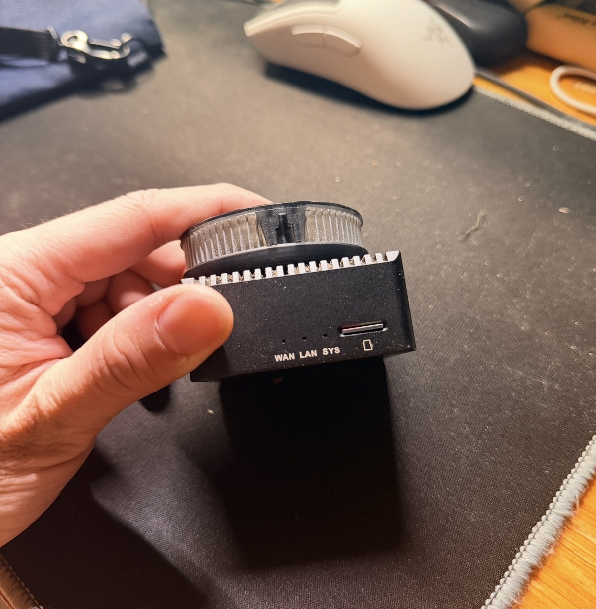

使用多年的r2s迎来了退役 躺到床上后越想越不开心 然后就起床寻找代替方案 发现现在的用的路由器be6500可以直接刷clash插件 很快的操作了下

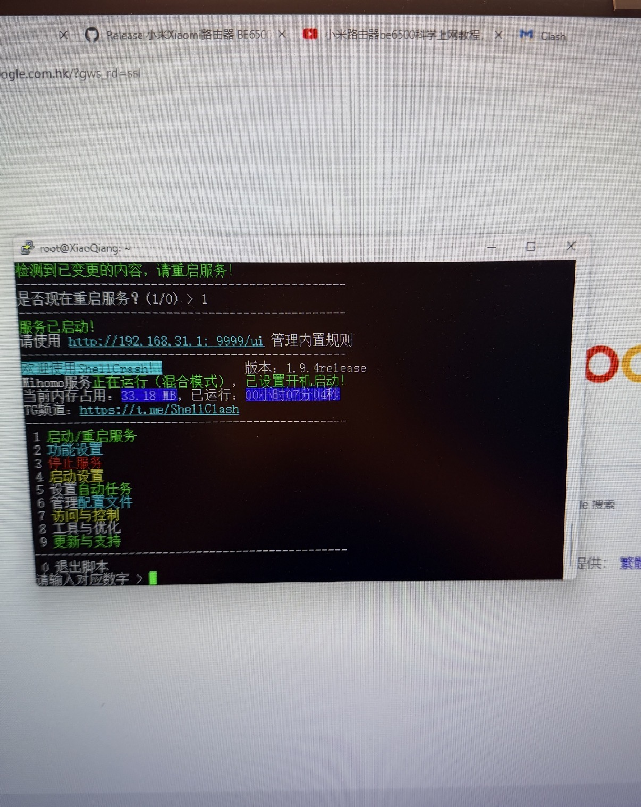

打算就这样将就用着 不想再折腾了 不想折腾了

---

## 最近的我

我常常问自己 我是个容易满足的人吗？我觉得既是又不是 很多人把“容易满足”理解成一种稳定的性格 但它更像是情境性的状态——会随着当下的需求、情绪、关系而变化

我对一些小的/即时的东西很容易产生满足感 比如一顿好吃的 一次被人多给一点点的善意 不需要很夸张的条件 有时候甚至会刻意降低期待 让自己轻松一点

被在意 被选择这些更核心的事情上 其实要求不低 会反复想：“这样真的够吗” 当内心不确定的时候 就很难真正满足

换了新车这件事也是 只短暂的感觉到了开心 随后怎么都提不起波澜反倒感觉失落 也和朋友聊了 我想要的也许并不是一辆新车 而是更深层的东西 但是到底是什么 我自己都不知道 写到这里感觉又有些难受 

---

## 写在最后

上次种下的食虫植物长势良好 绿丝叶茅膏菜杀疯了还偷偷抽出了花剑

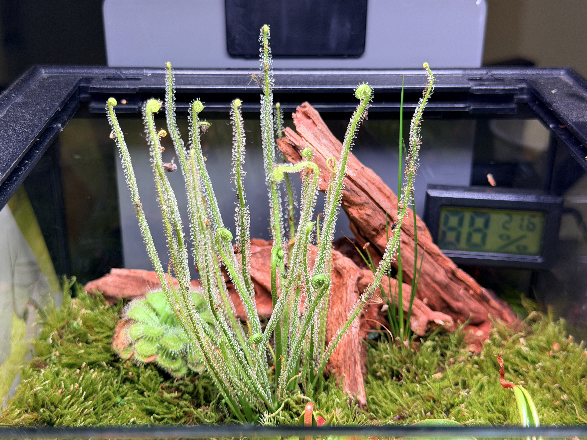

下次会在开花的时候再拍给大家看看 植物的生长很快有一种不同于动物的独特生命力

我要和它一样 好好活 

赶在清明节的尾巴发布此篇

下次见