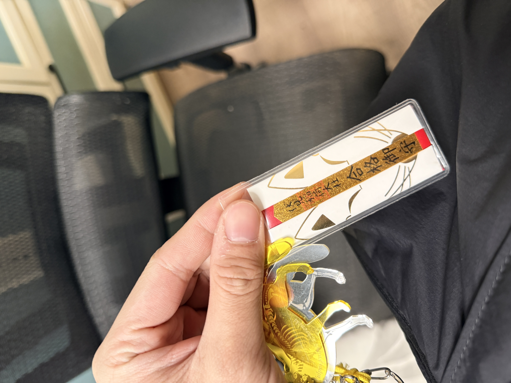

## 写在前面

生活和工作总是充满变化 我感觉到前所未有的劳累 敲完这段话我的手机已经自动锁屏的三次 是脑雾吗 我不知道 手机黑色的背景让我很恍惚 我是谁 我在哪 我该何去何从 

---

## 工作相关

因为同事的一起请假让本来人手充足的情况变得紧张起来 工作量分散到个人生长其实并不会多太多 只是因为需要时刻保证有看爬行动物的医生让我的排班非常混乱 经常是 早-晚-早 这种没有缓冲的状态

我喜欢一直有事情做的感觉 但是过于紧绷没有缓冲让我感觉到很疲劳

为了准备一场重要的考试复习也不能落下 让我神经衰弱 没有办法去专心做一件事情 思绪过后向院长请了1个月的长假 本来的想的是如果请不下来就直接辞职 但是出乎意料的通过了 她说我的脸色好差 让我好好休息复习

工作还需要交接一段时间 连着转了三年的我是不是也可以停下来一会呢 

---

## 食欲

最近基本处在一天只吃一顿饭的状态 明明肚子空空的但是就是不饿 大概是身体会很快适应不好的生活的习惯 去年爬完富士山到体重最高的时候胖了3kg多 截至5.5号为止已经瘦了1.5kg了 

如果这样下去大概会回到比较瘦的时候 

总是说人在幸福的时候会长胖 那相对的 人在感觉惆怅的时候是不是会变瘦呢（笑

⬆️近期吃的唯一一顿像样的饭 是五一假期和老爷子的聚餐

---

## 最近的我

我觉得我是你是个向上用力的人 不管是 职业选择 还是做事什么的

「总想往上爬」

要求是存在的 而且不低 不是随便可以敷衍自己的type

这是好的性格吗 我觉得不是 但是这种思维已经根深蒂固 

我对自己 对未来 对其他人都用了太大的力气 成长会很快 遇到问题也会陷更深 容易内耗 容易多想好多

总之让我好好的

休息一下

---

## 写在最后

实际上以上的内容已经在一些地方发布过了）抱歉我没有动力拍照片来填充这篇blog 只觉得厌烦 一切一切都让我感到疲惫 可是周围的人和事都没有变 所有的负面情绪其实全都来源我自己 随便了 反正很快就会习惯这样了吧