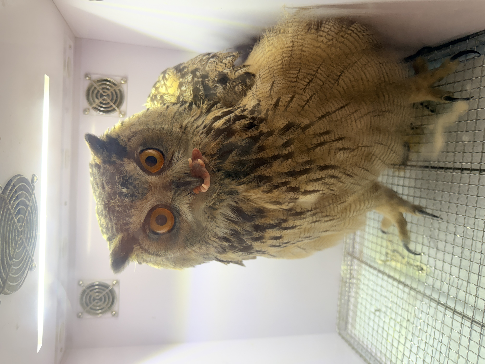
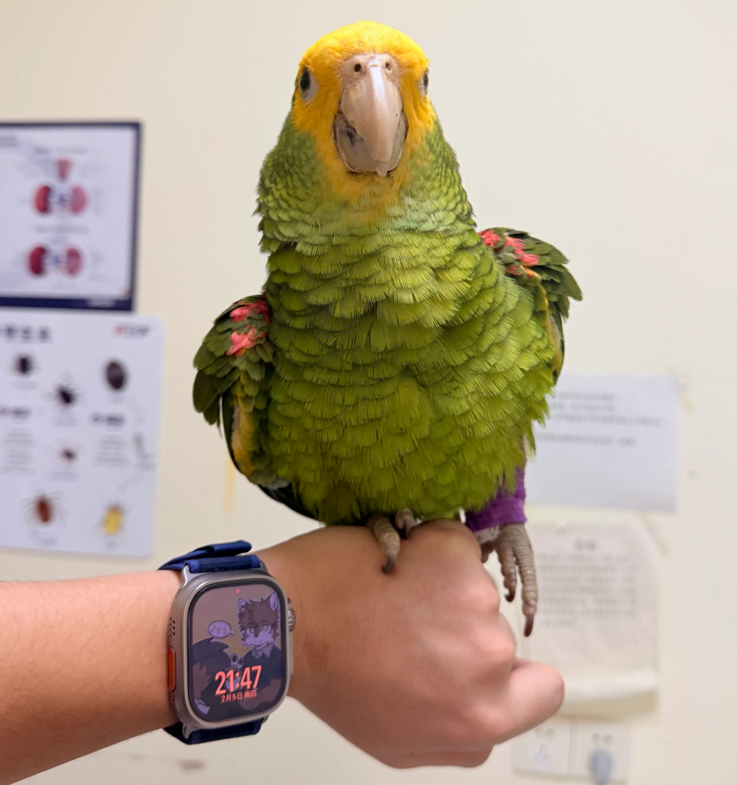
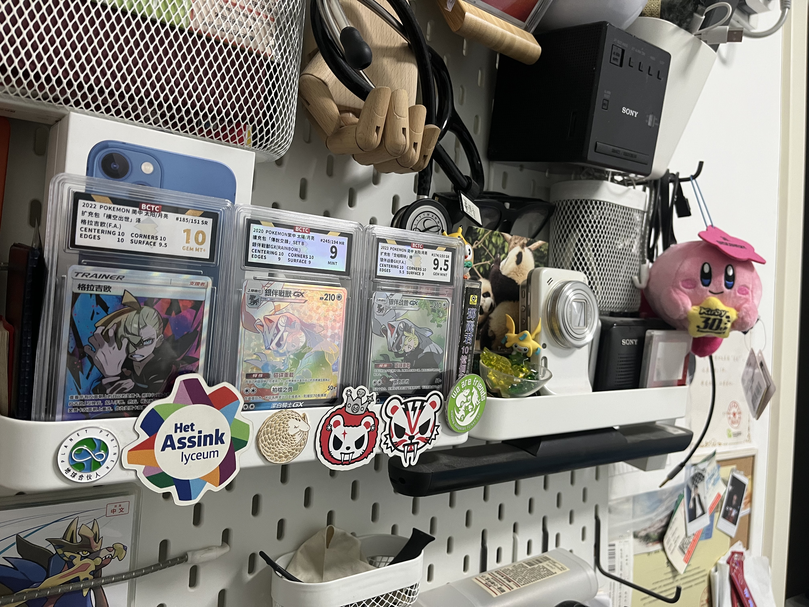
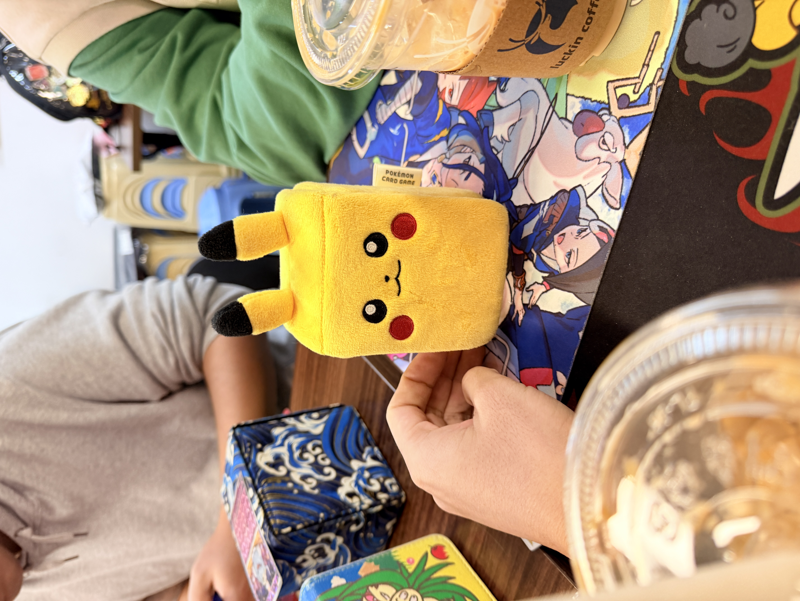
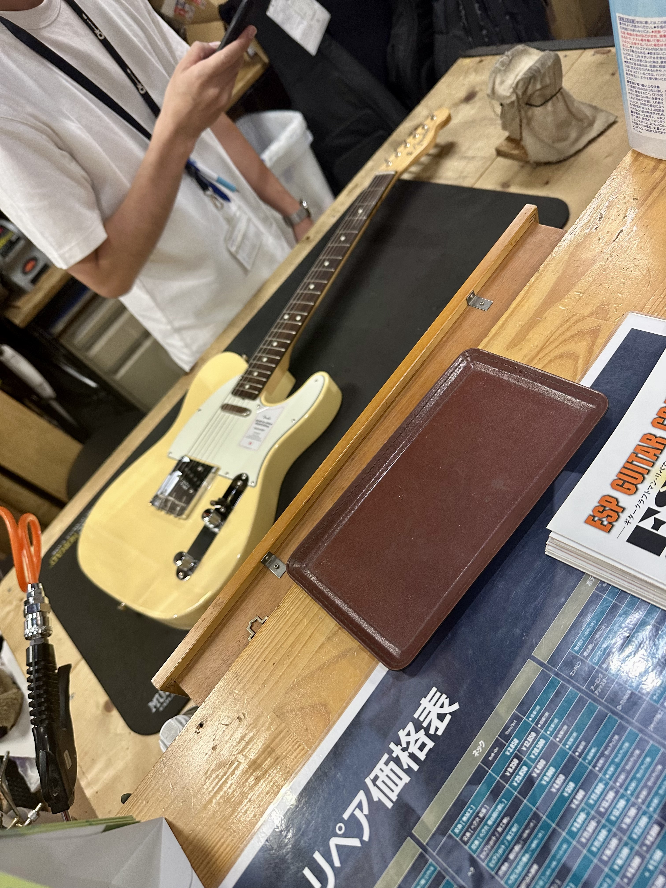

# 你好这里是  “小ton”

你们好喔 如果你能看到这一篇说明你在了解我 我想和你打个招呼!

## 写在前面

博客的建立比我想象中难许多 在此特别感谢小头对本站的大力支持 实际上如果没有获得小头的帮助此web根本无法建立）有点扯远了 这是我写的第一篇文章 从学生时代开始我就是一个容易半途而废的人 所以这个博客也不确定能不能好好的写下去 总之写一篇算一篇吧）更多是觉得 有些东西不写下来 好像就真的过去了 

## 有关于我

如果要给自己贴几个标签的话 大概是：兽医、i人、还有一个偶尔骑着摩托到处乱跑的人

是一名**异宠方向临床兽医** 

翅膀被人用弹珠打断截肢的雕鸮

脚骨折的亚马逊鹦鹉

做兽医这件事 说起来挺理想主义的 但日常其实很现实 大多数时候不是拯救生命的高光 而是面对选择 风险 还有一些无能为力 慢慢学会冷静 也会学会接受“已经尽力了”  慢慢也就变成了一个比较克制的人 不太容易大起大落

平时会玩一些主机游戏 算不上很硬核 就是想到什么玩什么 也会偶尔和朋友打打DOTA 或者线下玩几把PTCG 

桌面小角

说是娱乐 其实有时候更像是维持联系的一种方式 大家各忙各的 但还能在游戏里碰个面 宝可梦是一直没断过的东西 从小时候到现在 它更像是一种很稳定的存在 就算别的兴趣会变 这个好像一直不变

比卡超卡盒）

音乐的话偏向hard rock一点 声音大 节奏重 反而比较容易让我放松 

从日本背回了一把fender但是弹了没两次…

很喜欢收集磁带和CD 最喜欢的乐队是Mongol800

大部分时间其实挺“低能量”的 要么在家睡觉 什么都不做；要么就是骑摩托出去随便转一圈 没有特别明确的目的地 就只是出去走一走 有时会一个人出去旅游 走走停停

这个博客大概也会和这些东西差不多——没有什么固定主题 也不一定更新得很勤 可能是一些病例的随手记录 也可能只是最近在玩什么、听什么 或者某一天的状态

如果刚好有人看到 就当作是一个不太吵的角落）